# Bengaluru House Price Prediction System

A machine learning project that predicts house prices in Bengaluru using Linear Regression and Random Forest algorithms with advanced feature engineering capabilities.

## 🏠 Project Overview

This system provides an interactive interface to predict house prices based on various features like BHK (bedrooms), square footage, number of bathrooms, location, and area type. It offers two different machine learning approaches with basic and advanced feature sets.

## ✨ Features

- **Multiple ML Models**: Choose between Linear Regression and Random Forest
- **Feature Engineering**: Basic features (BHK, Sqft, Bathrooms) or Advanced features (includes location encoding, derived features)
- **Interactive Interface**: User-friendly command-line interface for predictions
- **Data Analysis**: Feature importance analysis and model interpretability
- **Confidence Intervals**: Get prediction confidence ranges with Random Forest
- **Outlier Removal**: Advanced outlier detection and removal techniques
- **Cross Validation**: Robust model evaluation with cross-validation

## 🚀 Installation & Setup

### Prerequisites
- Python 3.7 or higher
- Git (for cloning)

### Environment Setup

1. **Clone or download the project files**
   ```bash
   git clone https://github.com/Not-Buddy/ML_Regression_Model.git
   cd ML_REGRESSION_MODEL
   ```

2. **Create and activate virtual environment**
   ```bash
   python3 -m venv myenv
   source myenv/bin/activate  # On Windows: myenv\Scripts\activate
   
   # Alternative: Use the provided activation script
   chmod +x activateenv.sh
   source ./activateenv.sh
   ```

3. **Install required dependencies**
   ```bash
   pip install -r requirements.txt
   ```

4. **When done, deactivate virtual environment**
   ```bash
   deactivate
   ```

### Requirements File (requirements.txt)

Create a `requirements.txt` file with the following content:

```
pandas>=1.3.0
numpy>=1.21.0
scikit-learn>=1.0.0
```

## 📊 Data Requirements

The system expects a CSV file named `Bengaluru_House_Data_ML_Project.csv` in the `data/` directory with the following columns:
- `No of Bedrooms` (e.g., "2 BHK", "3 Bedroom")
- `Total_Sqft` (square footage, may include ranges)
- `No of Bathrooms` (number of bathrooms)
- `Price (In Lakhs)` (target variable)
- `Location` (optional, for advanced features)
- `Area_Type` (optional, for advanced features)

## 🎯 Usage

1. **Navigate to the src directory**
   ```bash
   cd src
   ```

2. **Run the main application**
   ```bash
   python3 main.py
   ```

3. **Choose your configuration:**
   - Model type: Linear Regression or Random Forest
   - Feature set: Basic or Advanced features

4. **Interactive options:**
   - **Custom Input**: Enter house details for prediction
   - **Demo**: See predictions on sample data
   - **Feature Analysis**: View feature importance and model insights
   - **Quit**: Exit the application

### Example Usage

```
Enter BHK, Sqft, Bathrooms (comma-separated): 3, 1500, 2

Input: BHK=3.0, Sqft=1500.0, Bathrooms=2.0
Predicted Price: ₹85.50 Lakhs
Predicted Price: ₹8550000
```

## 📁 Project Structure

```
ML_REGRESSION_MODEL/
├── data/
│   └── Bengaluru_House_Data_ML_Project.csv
├── myenv/                     # Virtual environment (auto-generated)
├── notebooks/                 # Jupyter notebooks for analysis
├── src/
│   ├── __pycache__/          # Python cache files (auto-generated)
│   ├── clean_data.py         # Data cleaning and preprocessing utilities
│   ├── house_price_predictor.py  # Base class for prediction models
│   ├── linear_regression.py  # Linear Regression implementation
│   ├── main.py              # Main application interface
│   ├── random_forest.py     # Random Forest implementation
│   └── sample_data.py       # Sample data for testing
├── .gitignore               # Git ignore file
├── activateenv.sh          # Environment activation script
├── README.md               # Project documentation
└── requirements.txt        # Python dependencies
```

## 🔧 Key Components

### Models Available
1. **Linear Regression**
   - Simple and interpretable
   - Shows feature coefficients
   - Good for understanding feature relationships

2. **Random Forest**
   - Higher accuracy
   - Feature importance analysis
   - Confidence intervals for predictions
   - Handles non-linear relationships

### Feature Sets
1. **Basic Features**
   - BHK (Bedrooms)
   - Square footage
   - Number of bathrooms

2. **Advanced Features**
   - All basic features plus:
   - Location encoding
   - Area type encoding
   - Derived ratios (bath per BHK, sqft per BHK)
   - Location-based price statistics

## 📈 Model Performance

The system provides detailed performance metrics:
- R² Score (coefficient of determination)
- Mean Squared Error (MSE)
- Root Mean Squared Error (RMSE)
- Cross-validation scores
- Feature importance rankings

## 🛡️ Data Quality Features

- **Outlier Detection**: Advanced outlier removal using IQR method by location
- **Data Validation**: Input validation and error handling
- **Missing Value Handling**: Intelligent handling of missing data
- **Feature Engineering**: Automatic creation of derived features

## 🎨 Customization

You can customize the models by:
- Adjusting hyperparameters in model classes
- Modifying feature engineering in `src/clean_data.py`
- Adding new prediction models by extending `BaseHousePricePredictor`
- Changing outlier removal thresholds
- Adding Jupyter notebooks in the `notebooks/` directory for data exploration

## Architecture diagram 

```mermaid
flowchart TD
    A[User Input] -->|House Details| B{Main Application<br/>main.py}
    B --> C{Choose Model Type}
    C -->|Linear Regression| D[Linear Regression<br/>linear_regression.py]
    C -->|Random Forest| E[Random Forest<br/>random_forest.py]    
    B --> F{Choose Feature Set}
    F -->|Basic| G[Basic Features<br/>BHK, Sqft, Bathrooms]
    F -->|Advanced| H[Advanced Features<br/>Location, Area Type,<br/>Derived Ratios]
    I[(CSV Dataset<br/>Bengaluru_House_Data.csv)] --> J[Data Preprocessing<br/>clean_data.py]
    J --> K[Data Cleaning]
    K --> L[Outlier Detection & Removal]
    L --> M[Feature Engineering]
    M --> N{Feature Processing}
    N -->|Basic Path| G
    N -->|Advanced Path| H
    G --> O[Model Training]
    H --> O    
    O --> D
    O --> E
    
    D --> P[Linear Prediction<br/>+ Feature Coefficients]
    E --> Q[RF Prediction<br/>+ Feature Importance<br/>+ Confidence Intervals]
    
    P --> R[Price Prediction Output]
    Q --> R
    
    B --> S[Interactive Options]
    S --> T[Custom Input]
    S --> U[Demo Mode]
    S --> V[Feature Analysis]
    S --> W[Model Evaluation]
    
    T --> A
    U --> X[Sample Data<br/>sample_data.py]
    V --> Y[Performance Metrics<br/>R², MSE, RMSE]
    W --> Z[Cross Validation<br/>Scores]
    
    X --> O
    Y --> R
    Z --> R
    
    AA[Base Class<br/>house_price_predictor.py] -.->|Inherits| D
    AA -.->|Inherits| E
    
    %% Dark theme styling with high contrast
    style A fill:#2d3748,stroke:#4a5568,stroke-width:2px,color:#ffffff
    style B fill:#1a202c,stroke:#2d3748,stroke-width:3px,color:#ffffff
    style C fill:#2d3748,stroke:#4a5568,stroke-width:2px,color:#ffffff
    style D fill:#553c9a,stroke:#6b46c1,stroke-width:2px,color:#ffffff
    style E fill:#065f46,stroke:#059669,stroke-width:2px,color:#ffffff
    style F fill:#2d3748,stroke:#4a5568,stroke-width:2px,color:#ffffff
    style G fill:#1e40af,stroke:#3b82f6,stroke-width:2px,color:#ffffff
    style H fill:#1e40af,stroke:#3b82f6,stroke-width:2px,color:#ffffff
    style I fill:#92400e,stroke:#f59e0b,stroke-width:2px,color:#ffffff
    style J fill:#374151,stroke:#6b7280,stroke-width:2px,color:#ffffff
    style K fill:#374151,stroke:#6b7280,stroke-width:2px,color:#ffffff
    style L fill:#374151,stroke:#6b7280,stroke-width:2px,color:#ffffff
    style M fill:#374151,stroke:#6b7280,stroke-width:2px,color:#ffffff
    style N fill:#2d3748,stroke:#4a5568,stroke-width:2px,color:#ffffff
    style O fill:#7c2d12,stroke:#ea580c,stroke-width:2px,color:#ffffff
    style P fill:#553c9a,stroke:#6b46c1,stroke-width:2px,color:#ffffff
    style Q fill:#065f46,stroke:#059669,stroke-width:2px,color:#ffffff
    style R fill:#7f1d1d,stroke:#dc2626,stroke-width:3px,color:#ffffff
    style S fill:#2d3748,stroke:#4a5568,stroke-width:2px,color:#ffffff
    style T fill:#1e3a8a,stroke:#3b82f6,stroke-width:2px,color:#ffffff
    style U fill:#1e3a8a,stroke:#3b82f6,stroke-width:2px,color:#ffffff
    style V fill:#1e3a8a,stroke:#3b82f6,stroke-width:2px,color:#ffffff
    style W fill:#1e3a8a,stroke:#3b82f6,stroke-width:2px,color:#ffffff
    style X fill:#374151,stroke:#6b7280,stroke-width:2px,color:#ffffff
    style Y fill:#7c2d12,stroke:#ea580c,stroke-width:2px,color:#ffffff
    style Z fill:#7c2d12,stroke:#ea580c,stroke-width:2px,color:#ffffff
    style AA fill:#581c87,stroke:#8b5cf6,stroke-width:2px,color:#ffffff
    
    %% Link styling for dark theme
    linkStyle default stroke:#9ca3af,stroke-width:2px
```



## 🐛 Troubleshooting

**Common Issues:**
1. **File not found error**: Ensure the CSV file is in the `data/` directory
2. **Module import errors**: Make sure virtual environment is activated and dependencies are installed
3. **Permission denied for activateenv.sh**: Run `chmod +x activateenv.sh` to make it executable
4. **Memory issues**: For large datasets, consider reducing the number of Random Forest estimators

## 📝 Development Workflow

1. **Data Exploration**: Use the `notebooks/` directory for exploratory data analysis
2. **Code Development**: All source code is in the `src/` directory
3. **Environment Management**: Use `activateenv.sh` for quick environment activation
4. **Version Control**: `.gitignore` is configured to exclude cache files and virtual environment

## 📝 License

This project is for educational purposes. Please ensure you have the rights to use any dataset you apply this code to.

## 🤝 Contributing

Feel free to contribute by:
- Adding new ML models in the `src/` directory
- Creating analysis notebooks in the `notebooks/` directory
- Improving feature engineering
- Enhancing the user interface
- Adding data visualization features
- Writing tests

## 📧 Support

If you encounter any issues or have questions about the implementation, please check the code comments and error messages for guidance.

***

**Happy Predicting! 🏡💰**
